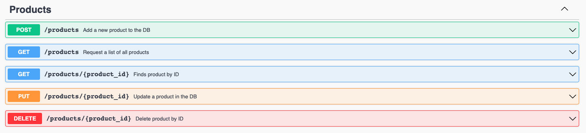

# Tee-Hee e-commerce (RESTful API)

The purpose of this project is to build a RESTful API for an e-commerce using Node.js, Express and Postgres.

A live demo is available at ### where is possible to create CRUD requests using Swagger UI like in the picture below:



Dependencies used in the project are:

- "bcrypt": "^5.0.1",
- "cors": "^2.8.5",
- "dotenv": "^9.0.2",
- "ejs": "^3.1.6",
- "express": "^4.17.1",
- "express-flash": "0.0.2",
- "express-session": "^1.17.1",
- "fs": "0.0.1-security",
- "js-yaml": "^4.1.0",
- "passport": "^0.4.1",
- "passport-local": "^1.0.0",
- "path": "^0.12.7",
- "pg": "^8.6.0",
- "swagger-ui-express": "^4.1.6"

The file directory schema is:

```.
├── api
│   ├── index.js
|   └── routes
│       └── auth
│       └── carts
│       └── orders
│       └── products
│       └── users
│   └── config
│       └── queries
│           └── carts_queries.js
│           └── orders_queries.js
│           └── products_queries.js
│           └── users_queries.js
│       └── dbConfig.js
│       └── passportConfig.js
│   └── views
│       └── dashboard.ejs
│       └── home.ejs
│       └── login.ejs
│       └── signup.ejs
└── swagger.yml
└── index.html
```

Database Schema:


