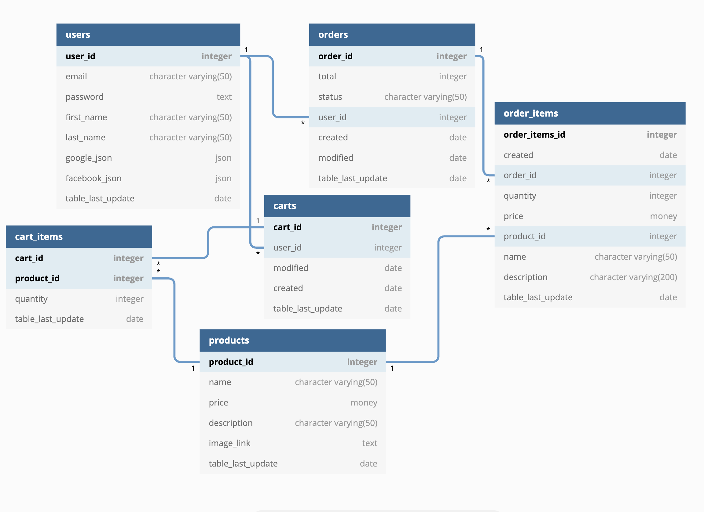

# Tee-Hee e-commerce (RESTful API)

The purpose of this project is to build a REST API for an e-commerce using Node.js, Express and Postgres.
The database/API will then used by a client to retrieve, modify and add (CRUD) elements.
The project also includes authentication for the users and account handling.

Database Schema:

Documentation is managed through Swagger.
